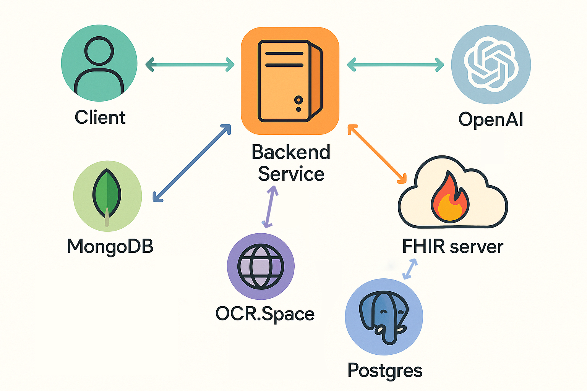

# 🚀 LabsExplained

A modern web application that allows patients to manage their medical data through FHIR integration and AI-powered lab result interpretation.

## 📈 Project Overview

This full-stack application consists of:

- ✨ **React + TypeScript Frontend** with modern UI components
- ⚡ **FastAPI Backend** for robust API handling
- ⚛️ **FHIR Integration** via dedicated microservice ([fhir-server-lite](https://github.com/iuliaL/fhir-server-lite))
- 🤖 **AI-Powered Analysis** using GPT-4 for lab result interpretation
- 📊 **MongoDB** for data persistence
- 🎨 **TailwindCSS** for beautiful, responsive design
- 📝 **OCR.space** for extracting text from lab result documents

## Architecture



## 👥 User Roles and Capabilities

### Patient
- Register and manage their profile
- Upload lab test results (PDF or image files, max 1MB)
- View their lab test history
- Get AI-powered interpretations of their lab results
- Reset their password if forgotten

### Admin
- View and manage all patients
- Delete patients and their data
- Assign admin roles to other users
- View all lab test results
- Manage lab test interpretations

## 🛠️ Technology Stack

### Frontend
- React 19.0.0
- TypeScript 4.9.5
- React Router 6.22.0
- TailwindCSS 3.3.0
- React Markdown 10.1.0

### Backend
- FastAPI 0.115.11
- Python 3.x
- MongoDB (via PyMongo 4.11.2)
- OpenAI API Integration
- Uvicorn 0.34.0 (ASGI server)

### FHIR Microservice
- PostgreSQL 14+ (required for FHIR server)
- [fhir-server-lite](https://github.com/iuliaL/fhir-server-lite)

## 📁 Project Structure

```sh
labsexplained/
├── frontend/                 # React + TypeScript frontend
│   ├── src/                 # Source files
│   ├── public/              # Static assets
│   └── package.json         # Frontend dependencies
│
├── backend/                 # FastAPI backend
│   ├── app/                 # Application code
│   │   ├── routes/         # API endpoints
│   │   ├── services/       # Business logic
│   │   ├── models/         # Data models
│   │   └── utils/          # Helper functions
│   └── requirements.txt     # Python dependencies
│
└── docs/                    # Documentation
```

## 🔍 API Endpoints

### Authentication
- `POST /auth/login` - User login
- `GET /auth/check-email` - Check if email exists
- `POST /auth/forgot-password` - Request password reset
- `POST /auth/reset-password` - Reset password
- `PUT /auth/assign-admin` - Assign admin role (admin only)

### Patient Management
- `POST /patients` - Register new patient
- `GET /patients` - Get all patients (admin only)
- `GET /patients/{fhir_id}` - Get patient details
- `DELETE /patients/{fhir_id}` - Delete patient (admin only)

### Lab Results
- `GET /lab_set/{patient_fhir_id}` - Get patient's lab test sets
- `POST /lab_set` - Upload lab test results (max 1MB)
- `DELETE /lab_set/{lab_test_set_id}` - Delete lab test set
- `POST /lab_set/{lab_test_set_id}/interpret` - Get AI interpretation
- `GET /observations/{observation_id}` - Get specific observation
- `DELETE /observations/{observation_id}` - Delete observation
- `DELETE /observations/patient/{patient_fhir_id}` - Delete all patient observations

For detailed API documentation, see [docs](docs/api.md).

## 🚀 Getting Started

### Prerequisites
- Node.js (v16+)
- Python 3.x
- MongoDB
- PostgreSQL 14+ (for FHIR server)
- OpenAI API key
- OCR.space API key (free tier available)
- Running instance of [fhir-server-lite](https://github.com/iuliaL/fhir-server-lite)

### Installation

1. Clone the repository:
```bash
git clone https://github.com/yourusername/labsexplained.git
cd labsexplained
```

2. Set up the backend:
```bash
cd backend
python -m venv venv
source venv/bin/activate  # On Windows: venv\Scripts\activate
pip install -r requirements.txt
```

3. Set up the frontend:
```bash
cd frontend
npm install
```

4. Configure environment variables:
- Copy `.env.example` to `.env` in both frontend and backend directories
- Fill in your API keys and configuration:
  - OpenAI API key
  - OCR.space API key (get a free one at [ocr.space](https://ocr.space/ocrapi))
  - FHIR server URL
  - PostgreSQL connection details for FHIR server

5. Start the development servers:
```bash
# Terminal 1 (Backend)
cd backend
uvicorn app.main:app --reload

# Terminal 2 (Frontend)
cd frontend
npm start

# Note: Ensure your FHIR server instance is running
```